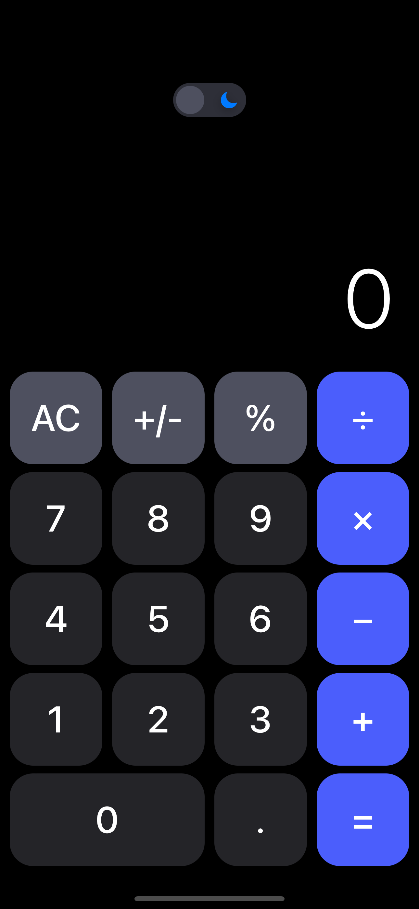
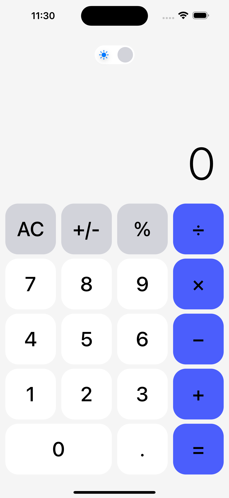

# CalcProject: A UI Challenge Project

## Introduction

CalcProject represents a modern UI challenge designed to showcase responsive design in calculator apps for iOS. This project focuses on the importance of creating interfaces that adapt seamlessly across a variety of device sizes, particularly in the context of iOS development using SwiftUI.

## Installation
### Prerequisites

- Xcode 14 or newer
- iOS 16 or newer for testing on a device

### Running the Project

To run this project, follow these steps:

```bash
git clone https://github.com/ddeerrrriicckk/CalcProject.git
cd CalcProject
open Calculator.xcodeproj
```

## Overview

In this project, the primary goal is to design a calculator interface that adjusts elegantly to different screen sizes and orientations. This interface is a testament to the power of responsive UI design, crucial in today's diverse ecosystem of mobile devices.

## Objectives

- To create a visually appealing calculator interface using SwiftUI.
- To ensure the UI scales correctly on devices of varying screen sizes.
- To implement a non-functional UI that mimics the appearance of a standard calculator app.

## Requirements

- A decimal number pad with digits 0-9.
- Basic arithmetic operation buttons: addition, subtraction, multiplication, and division.
- A display area for the entered digits and results.
- Automatic resizing and layout adjustments for different screen dimensions.

## Code Structure
#### Root
 - CalculatorApp.swift - The root of the application, which sets up the main view.
 - Constants.swift - Holds constant values used throughout the app for consistent styling.
#### Views
 - CalculatorView.swift - Contains the main user interface for the calculator, including the layout of the display and keypad.
 - ButtonHelper.swift - Contains helper functions for button-related actions.
#### Models
 - ArithmeticOperations.swift - Handles the logic for arithmetic calculations.
 - ButtonType.swift - Defines an enumeration for button types.
 - Digits.swift - Defines the digits and their properties within the calculator.
#### Styles
 - CustomButtonStyle.swift - A custom style modifier for buttons.
 - CustomToggleStyle.swift - A custom style modifier for toggle switches.

#### Here's an example of how the custom button style is applied:

```
Button(buttonType.description) {}
            .buttonStyle(CustomButtonStyle(
                size: 90,
                backgroundColor: buttonType.backgroundColor,
                foregroundColor: buttonType.foregroundColor,
                buttonWide: buttonType == .digits(.zero),
                lightMode: false)
            )
```

## Design and Implementation

This section explains the design philosophy and the steps taken to implement the CalcProject interface. It includes discussions on the use of SwiftUI and how it facilitates responsive design.

### Design Philosophy

The design of CalcProject is rooted in the principle of minimalism and functionality, aiming to deliver an intuitive user experience through a clean and modern interface.

### Implementation Details

Using SwiftUI's declarative syntax, CalcProject's interface has been meticulously assembled to ensure scalability and adaptability. Components are designed to be modular, promoting reusability and maintainability.

<p float="left">
  
  
</p>